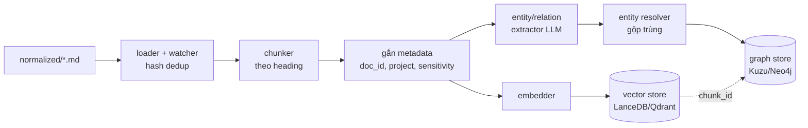
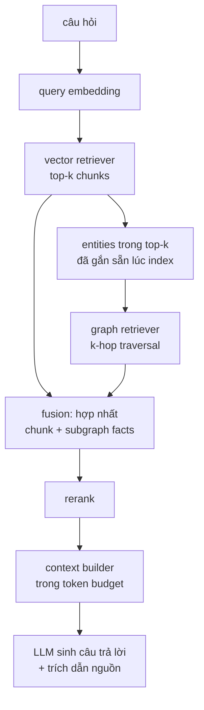

# Kiến trúc Hybrid GraphRAG cho kho tri thức cá nhân

## 1. Vị trí trong kho tri thức

Hệ thống này là lớp thứ ba, đặt sau hai lớp đã có:

```
artifacts/     → tài liệu gốc (pdf, docx, pptx, xlsx, msg...), không đổi
normalized/    → text/markdown đã chuẩn hoá từ artifacts/ (đã có, xem bang-file-type-ai-tool.md)
graphrag-engine/ → index (vector + graph) và truy vấn, xây trên normalized/
```

Nguyên tắc: **graphrag-engine không bao giờ đọc trực tiếp `artifacts/`**. Mọi thứ đi qua `normalized/` trước — nhờ vậy hệ thống index không phụ thuộc vào việc từng loại file gốc có đọc được trực tiếp hay không (đã giải quyết ở lớp normalize).

## 2. Vì sao Hybrid, và khi nào KHÔNG cần

Vector-only RAG trả lời tốt câu hỏi "tìm đoạn liên quan đến X". Nó trả lời kém câu hỏi cần nối nhiều tài liệu qua quan hệ, ví dụ:

- "Những hệ thống nào phụ thuộc vào MSBPay?"
- "Ai đã tham gia các cuộc họp liên quan đến eKYC trong quý 2?"
- "Dự án nào đang dùng chung module với Magnet?"

Đây là các câu hỏi **multi-hop** — cần graph traversal, không chỉ similarity search. Ngược lại, nếu phần lớn câu hỏi thực tế chỉ là tra cứu nội dung một tài liệu ("báo cáo CIO Q2 nói gì về X"), vector-only đã đủ và graph layer là chi phí không cần thiết.

→ Khuyến nghị: **build MVP vector-only trước** (Giai đoạn 1, mục 7), dùng thực tế một thời gian, rồi mới quyết định có cần graph layer hay không dựa trên loại câu hỏi thường gặp — thay vì build hybrid ngay từ đầu.

### 2.1. Cập nhật 2026-08-04 — đã build hybrid và đo thực tế, kết quả xác nhận khuyến nghị trên

Graph layer + hybrid retrieval đã được code và build thật trên toàn bộ `normalized/` (xem mục 9). Trước khi tin dùng, đã kiểm chứng bằng 2 cách:

1. **Cross-check 2 lần extraction độc lập** (`scripts/cross_check_graph.py`, model `gpt-4o-mini` vs `gpt-5.4` trên cùng corpus): **~0% quan hệ trùng nhau**, kể cả khi nới lỏng chỉ so cặp entity (bỏ qua loại quan hệ). Hai lần chạy độc lập gần như không hội tụ về cùng 1 tập "sự thật".
2. **So sánh câu trả lời thật** trên câu hỏi multi-hop ("MSBPay phụ thuộc hệ thống nào?"): câu trả lời dựa vào graph fact bị chính LLM sinh câu trả lời tự flag "không được đoạn văn bản xác nhận"; câu trả lời `--no-graph` (thuần vector) có trích dẫn trang cụ thể, kiểm tra lại được ngay và không cần caveat.

**Kết luận**: extraction hiện tại recall cao nhưng precision thấp trên loại văn bản thực tế ở đây (email, ghi chú họp, slide rời rạc — không phải văn bản có cấu trúc rõ ràng). → **Graph/hybrid đã TẮT mặc định** (`build_graph=False`, `use_graph=False`), chỉ bật thủ công qua `--graph` khi chủ động muốn thử nghiệm/cải thiện (siết prompt extraction, thêm bước lọc evidence yếu, hoặc thử ontology khác). Chi tiết xem `README.md` mục Trạng thái.

## 3. Sơ đồ luồng dữ liệu — Index (build)



Chunk và graph node dùng chung `chunk_id`/`doc_id` để nối ngược giữa hai kho — đây là điểm mấu chốt khiến "hybrid" hoạt động được ở bước truy vấn.

Nhánh `M → X → R → GS` (entity/relation extraction) chỉ chạy khi `graphrag build --graph` — mặc định `graphrag build` bỏ qua nhánh này (mục 2.1).

## 4. Sơ đồ luồng dữ liệu — Truy vấn (query)



Điểm khác biệt so với vector-only: graph retriever có thể kéo về những chunk **không lọt top-k vector** nhưng liên quan qua quan hệ với entity trong top-k — đây chính là phần "graph bù cho vector" trong multi-hop.

Nhánh `EN → GR → FU` chỉ chạy khi `graphrag query --graph` — mặc định `graphrag query` là vector-only thuần (`VR → CB → GEN`), bỏ qua toàn bộ graph retriever/fusion (mục 2.1).

Sơ đồ trên giản lược — thực tế `VR` gồm 3 cơ chế song song (exact/keyword/vector, xem `pipeline/query.py`), hợp nhất qua `retrieval/hybrid.py:fuse_ranked_lists` trước khi tới `FU` (graph fusion). **Từ 2026-08-24 (query-time federation, Phase 5)**: cả 3 cơ chế này chạy 1 lần nữa trên `tenants/_common` (song song với tenant đang query, trọng số thấp hơn) và gộp chung vào cùng 1 lượt `fuse_ranked_lists` — graph retriever/fusion (nhánh `EN → GR → FU`) KHÔNG mở rộng sang `_common`, chỉ chạy trên tenant chính (đơn giản hơn, và `--graph` vốn đã tắt mặc định). Xem `_resolve_common_settings`/`_retrieve_from_store` trong `pipeline/query.py`.

## 5. Cấu trúc thư mục

```
graphrag-engine/
├── README.md
├── ARCHITECTURE.md            ← tài liệu này
├── pyproject.toml
├── .env.example
├── config/
│   ├── settings.yaml           # đường dẫn, chọn backend (embedded/scale), model
│   ├── chunking.yaml            # chunk size/overlap theo loại tài liệu
│   ├── graph_schema.yaml        # ontology: node/edge types
│   └── prompts/                 # prompt cho extraction + answer synthesis
├── src/graphrag/
│   ├── ingestion/                # đọc normalized/, watcher, dedup
│   ├── chunking/                 # cắt đoạn + gắn metadata
│   ├── embedding/                 # sinh vector, cache (Voyage | local fastembed)
│   ├── vector_store/              # base.py (+ get_by_ids cho fusion), lancedb_store.py
│   ├── graph_extraction/          # entity_extractor.py, relation_extractor.py, resolver.py,
│   │                              # _llm_util.py (provider-agnostic openai|claude, giống answer_generator.py)
│   ├── graph_store/                # base.py, kuzu_store.py (schema sinh động từ graph_schema.yaml),
│   │                              # __init__.py: load_ontology() + try_open() dùng chung
│   ├── retrieval/                 # vector_retriever.py, graph_retriever.py, fusion.py
│   ├── generation/                # context_builder.py + answer_generator.py
│   ├── pipeline/                  # build_index.py (build_graph flag), query.py (use_graph flag)
│   └── cli.py                     # `graphrag build [--graph] [--watch]`, `graphrag query [--graph] [--no-answer]`
├── data/                        # vector_index/, graph_db/, cache/ (không share)
│                                 # graph_db_gpt-4o-mini/, graph_db_gpt-5.4/: bản lưu để cross-check (mục 2.1)
├── scripts/                     # eval_extraction_sample.py (soát thủ công mẫu chunk trước khi tin graph),
│                                 # cross_check_graph.py (so 2 graph_db build độc lập)
├── tests/
└── notebooks/
```

Mỗi thư mục con trong `src/graphrag/` đã có `README.md` giải thích vai trò cụ thể — đọc trực tiếp trong thư mục tương ứng.

## 6. Ontology khởi điểm

Suy ra từ loại tài liệu thực tế đang có (báo cáo, backlog, MoM, tài liệu giải pháp cho MSBPay, eKYC, Magnet, DIP...). Định nghĩa đầy đủ ở `config/graph_schema.yaml`.

| Node type | Ý nghĩa | Ví dụ |
|---|---|---|
| Document | 1 tài liệu trong normalized/ | `MSBPay_Backlog.xlsx` |
| Project | Dự án/sáng kiến | MSBPay, New_eKYC, Magnet, DIP |
| System | Hệ thống/ứng dụng | Kiosk, MConnect, ePay |
| Person | Người xuất hiện trong tài liệu | tên trong MoM, báo cáo |
| Organization | Đối tác/tổ chức ngoài | Techcombank (đối chiếu) |
| Concept | Thuật ngữ nghiệp vụ | "eKYC", "Chi hộ" |
| Chunk | Node neo, không phải entity thật | dùng để join sang vector store |

| Edge type | Chiều |
|---|---|
| MENTIONS | Chunk → Project/System/Person/Organization/Concept |
| BELONGS_TO | Document → Project |
| PART_OF | System → Project |
| DEPENDS_ON | System/Project → System/Project |
| OWNED_BY | Project → Person |
| ATTENDED | Person → Document (khi Document.doc_type = MoM) |
| RELATED_TO | Concept → Concept (fallback chung) |

Ontology nên **cố định và mở rộng có chủ đích** — nếu để LLM tự do đặt loại node/edge mới, graph sẽ phân mảnh rất nhanh và hết tác dụng traversal. Log lại các đề xuất loại mới ngoài danh sách để review định kỳ thay vì tự động chấp nhận.

**Cập nhật thực tế**: `pipeline/build_index.py` có bước validate cặp `(from_type, to_type)` của mỗi relation LLM trích ra so với bảng edge type ở trên — Kuzu crash toàn bộ build nếu MERGE 1 cạnh với type không khớp schema (đã gặp thật, vd LLM trả `Person ATTENDED Person` thay vì `Person ATTENDED Document`). Relation không khớp bị **bỏ qua + log**, không sửa tự động. Trên build thật, tỷ lệ bị bỏ khá cao (~60-80% relation LLM đề xuất) — 1 phần lý do khiến graph chưa đủ tin cậy, xem mục 2.1.

## 7. Lựa chọn công nghệ: MVP so với khi cần scale

Bạn mô tả đúng ngưỡng: hybrid chỉ đáng công khi kho lớn (hàng nghìn tài liệu) và nhiều người dùng. Vì vậy thiết kế này tách rõ MVP (chạy embedded, không cần server nào) khỏi bản scale-up, và interface (`base.py` ở mỗi module) được viết để swap được mà không đổi code gọi phía trên.

| Thành phần | MVP (mặc định) | Khi scale lên |
|---|---|---|
| Vector store | **LanceDB** — embedded, file-based, không cần Docker | **Qdrant** — self-host qua Docker, multi-user, filter mạnh |
| Graph store | **Kuzu** — embedded, Cypher-compatible, không cần server | **Neo4j** — multi-user, có Browser/Bloom để người không kỹ thuật tự xem graph |
| Embedding | Voyage AI (`voyage-3`) cho tài liệu không nhạy cảm — **thực tế đang chạy local** (`fastembed`, không có `VOYAGE_API_KEY`) | Thêm dedicated embedding server nếu volume lớn |
| Entity/relation extraction | Provider chọn qua `llm.extraction_provider` (`config/settings.yaml`) — **thực tế đang dùng OpenAI `gpt-5.4`**, cũng hỗ trợ Claude. Model OpenAI đời mới cần param `max_completion_tokens` thay vì `max_tokens` (đã xử lý ở `_llm_util.py`). **Mặc định TẮT từ 2026-08-04** (mục 2.1) | Thêm queue (Celery/RQ) để chạy nền |
| Answer generation | Provider chọn qua `llm.answer_provider` — thực tế đang dùng OpenAI `gpt-5.4` | Giống MVP, thêm prompt caching |
| Giao diện | CLI (`graphrag query "..."`) | API (FastAPI) + web UI cho nhiều người dùng |

Ngưỡng nên cân nhắc migrate lên bản scale-up:
- Vector index/graph vượt khoảng 5.000–10.000 chunk và latency tăng rõ rệt.
- Cần nhiều người dùng ghi/đọc đồng thời (embedded store thường single-writer).
- Cần người không kỹ thuật tự khám phá graph trực quan (Neo4j Bloom).
- Cần phân quyền truy cập theo phòng ban/dự án.

## 8. Bảo mật dữ liệu nội bộ

Nhiều tenant dưới `tenants/` chứa tài liệu nội bộ ngân hàng (báo cáo CIO, backlog, MoM, tài liệu giải pháp). Đây là điểm cần xử lý cẩn thận trước khi build:

1. Gắn `sensitivity` (`internal` / `confidential`) cho mỗi chunk ngay ở bước chunking (`src/graphrag/chunking/metadata.py`), theo `sensitivity_rules` (path prefix, tính từ `normalized/` của đúng tenant) — kể từ khi tách `tenants/` (2026-08-22), rule này không còn nằm trong `config/settings.yaml` dùng chung nữa mà nằm ở overlay riêng `tenants/<org>/<ws>/config/settings.yaml` (chỉ 2 khoá `sensitivity_rules`/`visibility_rules` được đọc từ đó, xem `Settings.load(tenant_root=...)`). **Đã áp dụng thật**: `tenants/msb/ekyc/config/settings.yaml` đánh dấu prefix `ePay/` (hợp đồng, hoá đơn VAT) là `confidential`.
2. Với chunk `confidential`: build tự route sang embedding local (`fastembed`, xem `_resolve_build_provider`) và **extraction tự skip hoàn toàn** (không gọi LLM nào, xem `_extract_graph_for_chunk`) — không dùng LLM local riêng cho confidential (khác thiết kế ban đầu định dùng Ollama; hiện đơn giản là bỏ qua, chưa cần xử lý phức tạp hơn ở quy mô này).
3. **`sensitivity` KHÔNG phải access control** — chỉ quyết định content có được gửi ra provider cloud hay không, không giới hạn ai được query gì.
4. Thư mục `data/` (vector index, graph db) không đồng bộ/chia sẻ ra ngoài máy cá nhân.
5. Xác nhận với bộ phận an ninh thông tin/tuân thủ trước khi kết nối bất kỳ API cloud nào với dữ liệu nội bộ — đây là quyết định ngoài phạm vi kỹ thuật của tài liệu này.

### 8.1. Access control thật — `graphrag serve` (2026-08-04)

Trước đây hệ thống chỉ có 1 người dùng qua CLI, không cần access control. Từ khi có nhu cầu
cho 1 đồng nghiệp truy vấn qua API, đã thêm trục phân loại **`visibility`** (`owner`/`shared`,
độc lập với `sensitivity`) — đây mới thực sự là ranh giới bảo mật:

- Lọc xảy ra **ở tầng vector search** (`vector_store.search(..., filters={"visibility":"shared"})`),
  trước khi bất kỳ nội dung nào vào context của LLM — không dựa vào prompt instruction để "dặn"
  model giấu thông tin, vì đó không phải ranh giới bảo mật thật.
- Mặc định **toàn bộ private** (`owner`) — người dùng tự mở dần qua `visibility_rules` trong
  `config/settings.yaml`. Đã duyệt mở `MSBPay/`, `Magnet/`, `New_eKYC/`, `DIP/` cho 1 đồng nghiệp
  cùng phòng (2026-08-04).
- **Ràng buộc cứng**: `sensitivity: confidential` luôn ép `visibility: owner`, bất kể
  `visibility_rules` nói gì (`ingestion/loader.py._guess_visibility`) — hợp đồng/hoá đơn `ePay/`
  không bao giờ lọt ra API dù lỡ set rule sai.
- API (`src/graphrag/api.py`, chạy qua `graphrag serve`) chỉ nên mở trong mạng nội bộ/VPN —
  code không tự bảo vệ khỏi việc bị truy cập từ internet công khai, đó là trách nhiệm hạ tầng.
- Xem chi tiết cách dùng ở `README.md` mục API.

## 9. Lộ trình triển khai

| Giai đoạn | Nội dung | Trạng thái (2026-08-04) |
|---|---|---|
| 0 — Chuẩn hoá | Đảm bảo `normalized/` đầy đủ, nhất quán metadata | **Xong** — 38 tài liệu, phủ hết `artifacts/` convertible (kể cả OCR) |
| 1 — MVP vector RAG | chunk + embed + LanceDB + LLM trả lời, chưa có graph | **Xong, chạy trên dữ liệu thật** — 432 chunk indexed, `tests/smoke_test.py` pass |
| 2 — Xây graph layer | Entity/relation extraction toàn bộ `normalized/`, build Kuzu graph theo ontology mục 6 | **Code xong, đã build thật 3 lần** (2× `gpt-4o-mini`, 1× `gpt-5.4`). Điều kiện hoàn thành (soát mẫu 30 chunk + cross-check) **KHÔNG đạt** — xem mục 2.1. `build_graph=False` mặc định |
| 3 — Hybrid retrieval | Nối vector retriever + graph retriever qua fusion | **Code xong, đã so sánh hybrid vs vector-only trên câu hỏi thật** (mục 2.1) — vector-only tốt hơn rõ rệt. `use_graph=False` mặc định, bật qua `--graph` |
| 4 — Vận hành | Incremental re-index (watcher), CLI ổn định | **Xong** — `graphrag build --watch` |
| 5 — Scale-up (chỉ khi cần) | Migrate LanceDB→Qdrant, Kuzu→Neo4j, thêm API/UI | Chưa cần — quy mô hiện tại (432 chunk, 1 người dùng) còn xa các ngưỡng ở mục 7 |

Diễn biến thực tế **đúng như khuyến nghị gốc ở mục 2** đã cảnh báo: nhảy thẳng vào Giai đoạn 2-3 trước khi có bằng chứng vector-only không đủ dẫn tới việc phải build/test/rồi tắt lại graph — tốn effort nhưng không mất công vô ích, vì giờ đã có bằng chứng cụ thể (không phải suy đoán) cho quyết định tắt mặc định, và code graph vẫn sẵn sàng dùng lại khi cải thiện được precision của extraction.
