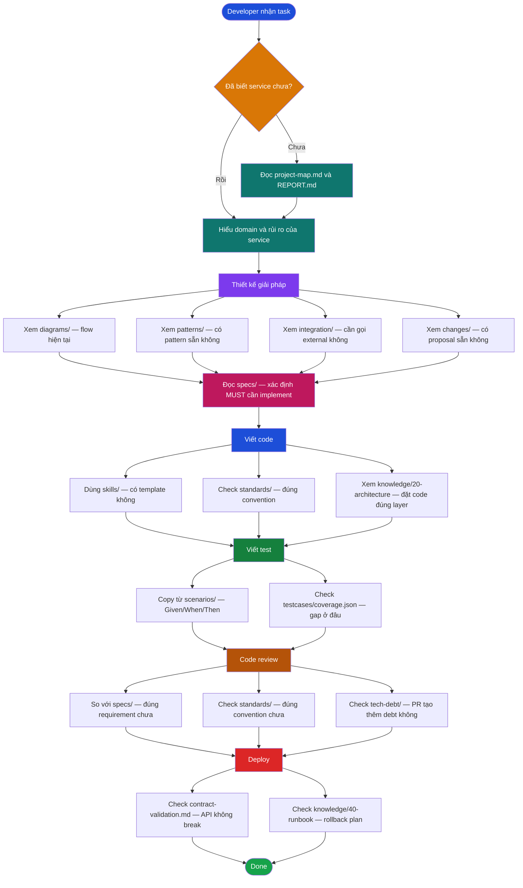
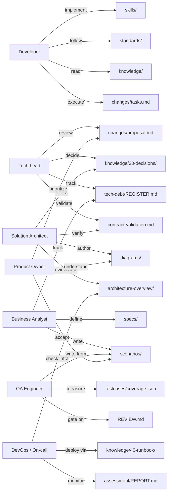
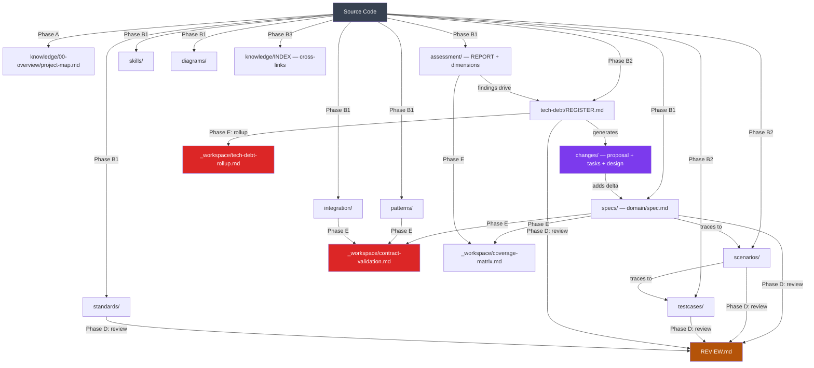

# Artifact Guide — Bản đồ tài liệu OpenSpec

<details>
<summary>📖 Định nghĩa Confidence Levels</summary>

| Mức | Ký hiệu | Ý nghĩa |
|-----|---------|---------|
| `observed` | ✅ (không callout) | Trực tiếp đọc từ source code / config — không suy luận |
| `inferred-high` | 🟡 | Suy luận có cơ sở từ nhiều file, xác suất cao |
| `inferred-low` | 🔴 | Suy luận yếu — cần xác nhận từ người biết hệ thống |
| `needs-human-review` | ❓ | Không đủ evidence — cần SA/TL/BA/PO xác nhận |

</details>


> Tài liệu này giải thích ý nghĩa, tác dụng và thời điểm sử dụng từng artifact trong thư mục `openspec/`
> theo góc nhìn thực tế của một developer trong vòng đời phát triển phần mềm.

---

## 1. Bản đồ cấu trúc tổng thể

```mermaid
flowchart TD
    ROOT["openspec/"]:::root

    ROOT --> T1["TẦNG 1 — Hiểu hệ thống"]:::tier
    ROOT --> T2["TẦNG 2 — Đặc tả hành vi"]:::tier
    ROOT --> T3["TẦNG 3 — Tái sử dụng"]:::tier
    ROOT --> T4["TẦNG 4 — Hành động"]:::tier
    ROOT --> TW["WORKSPACE — Đa dự án"]:::tierw

    T1 --> A1["assessment/ — Đánh giá sức khoẻ"]
    T1 --> K1["knowledge/ — Tri thức hệ thống"]
    T1 --> D1["diagrams/ — Biểu đồ luồng"]
    T1 --> I1["integration/ — Contract bên ngoài"]

    T2 --> S1["specs/ — Đặc tả yêu cầu"]
    T2 --> SC["scenarios/ — Kịch bản hành vi"]
    T2 --> TC["testcases/ — Test cases"]
    T2 --> ST["standards/ — Coding conventions"]

    T3 --> PT["patterns/ — Design patterns"]
    T3 --> SK["skills/ — Kỹ năng tái dùng"]

    T4 --> CH["changes/ — Kế hoạch thay đổi"]
    T4 --> TDb["tech-debt/ — Nợ kỹ thuật"]
    T4 --> RV["REVIEW.md — Kiểm tra chất lượng"]

    TW --> AO["architecture-overview/ — Kiến trúc platform"]
    TW --> CV["contract-validation.md — Xác minh API"]
    TW --> CM["coverage-matrix.md — Ma trận coverage"]
    TW --> TR["tech-debt-rollup.md — Nợ kỹ thuật platform"]

    classDef root fill:#1f2937,color:#f9fafb,stroke:#374151
    classDef tier fill:#1d4ed8,color:#fff,stroke:#1e40af
    classDef tierw fill:#7c3aed,color:#fff,stroke:#6d28d9
```



---

## 2. Artifact theo tầng — Ý nghĩa và tác dụng

### Tầng 1 — Hiểu hệ thống

#### `assessment/`
Bộ đánh giá sức khoẻ toàn diện của codebase, được sinh tự động từ phân tích source code.

| Artifact | Nội dung | Dùng khi nào |
|----------|---------|-------------|
| `REPORT.md` | Điểm tổng thể (1–5 sao), danh sách findings chia Critical / High / Medium / Low | **Đọc đầu tiên** khi tiếp cận service mới — biết ngay rủi ro lớn nhất ở đâu |
| `COMPLEXITY.md` | Hotspot phức tạp (cyclomatic complexity), module coupling, LOC distribution | Khi cần quyết định refactor module nào, ước tính effort |
| `dimensions/security.md` | Lỗ hổng bảo mật, hardcoded credentials, thiếu auth | Trước khi viết code auth, input handling, API mới |
| `dimensions/testability.md` | Coverage thực tế, code có testable không | Trước khi estimate viết test |
| `dimensions/architecture.md` | Coupling cao ở đâu, vi phạm layered architecture | Trước khi thêm tính năng lớn |
| `dimensions/performance.md` | Điểm nghẽn hiệu năng đã biết, N+1 queries | Khi debug chậm hoặc thiết kế API |
| `dimensions/maintainability.md` | Code smell, dead code, duplication | Khi estimate effort cho một thay đổi |
| `dimensions/reliability.md` | Error handling, retry, circuit breaker | Khi thiết kế integration với service ngoài |
| `findings.json` | Machine-readable findings | CI/CD pipeline, dashboard |

---

#### `knowledge/`
Tri thức tích luỹ về hệ thống — "tại sao" thay vì "cái gì".

| Thư mục | Nội dung | Dùng khi nào |
|---------|---------|-------------|
| `00-overview/project-map.md` | Bản đồ toàn service: modules, entry points, tech stack, số file | **Lần đầu onboarding** — đọc trong 5 phút để định hướng |
| `10-domain/business-domain.md` | Khái niệm nghiệp vụ, bounded context, ngôn ngữ chung | Trước khi đặt tên class/method/biến — dùng đúng ubiquitous language |
| `20-architecture/overview.md` | Kiến trúc layered, data flow chính, dependency direction | Khi cần biết đặt code mới vào đúng layer nào |
| `20-architecture/request-flow.md` | Request đi qua bao nhiêu lớp, middleware nào | Khi debug request fail hoặc thiết kế endpoint mới |
| `20-architecture/data-model.md` | Entity chính, quan hệ DB, indexes | Khi viết query hoặc migration schema |
| `30-decisions/adr-*.md` | Architectural Decision Records — lý do chọn giải pháp X thay vì Y | Trước khi đề xuất thay đổi stack — tránh repeat lý do đã từng bị bác |
| `40-runbook/ops-notes.md` | Cách deploy, rollback, xử lý incident | Khi on-call hoặc chuẩn bị release production |
| `INDEX.md` | Cross-link toàn bộ knowledge | Điểm xuất phát khi không biết tìm gì |

---

#### `diagrams/`
Biểu đồ Mermaid (sequence, flowchart, state, ER) trích xuất từ code thực tế.

| File | Nội dung | Dùng khi nào |
|------|---------|-------------|
| `auth-flow.md` | Sequence login → refresh token → logout | Implement tính năng auth, debug token invalid |
| `data-flow.md` | Data từ UI → API → DB → response | Debug data inconsistency |
| `*-flow.md` | User journey theo domain nghiệp vụ | Phân tích nghiệp vụ, demo với PO |

---

#### `integration/`
Contract tích hợp với hệ thống ngoài — REST, event, file.

| File | Nội dung | Dùng khi nào |
|------|---------|-------------|
| `backend-api.md` | Endpoint, request/response schema, auth method | Trước khi viết HTTP call mới |
| `<system>.md` | Contract chi tiết với từng hệ thống (Mobio, CIC, PowerBI…) | Khi làm tính năng dùng hệ thống đó |

---

### Tầng 2 — Đặc tả hành vi

#### `specs/<domain>/spec.md`
Yêu cầu hành vi theo từng domain nghiệp vụ, viết bằng RFC-2119 (MUST / SHOULD / MAY).

```
REQ-AUTH-001: System MUST validate JWT signature on every protected endpoint.
REQ-AUTH-002: System SHOULD refresh token automatically 5 minutes before expiry.
```

**Dùng khi:**
- Implement → đọc MUST nào cần đáp ứng, tránh implement sai
- Code review → so sánh implementation với spec
- Viết test → lấy requirement ID làm test ID để traceability

---

#### `scenarios/<domain>.md`
Kịch bản hành vi Given/When/Then gắn với Requirement ID.

```
Scenario SCN-AUTH-001 [REQ-AUTH-001]
  Given user gửi request đến protected endpoint
  When JWT token đã hết hạn
  Then server trả về 401 Unauthorized
  And response body chứa error code "TOKEN_EXPIRED"
```

**Dùng khi:**
- Viết unit/integration test — copy scenario làm test description
- Acceptance testing — demo từng scenario với Product Owner
- Tìm edge case — scenario đã liệt kê các case quan trọng

---

#### `testcases/<module>.md` + `coverage.json`
Danh sách test cases có cấu trúc, gắn Requirement ID, đo coverage.

**Dùng khi:**
- Sprint planning → xem domain nào coverage thấp, ưu tiên viết test
- CI gate → block merge nếu coverage giảm dưới threshold
- QA → biết test nào còn thiếu

---

#### `standards/<topic>.md`
Coding conventions **thực tế** quan sát từ codebase — có ví dụ đúng/sai.

```markdown
## Naming — API Response Fields
✅ camelCase: { userId, createdAt, taxCode }
❌ snake_case: { user_id, created_at, tax_code }
```

**Dùng khi:**
- Onboarding → đọc trước khi viết dòng code đầu tiên
- Code review → reference standards thay vì viết comment dài
- Linting rule → biến conventions thành automated check

---

### Tầng 3 — Tái sử dụng

#### `patterns/<pattern>.md`
Design pattern **thực sự được dùng** trong project — không phải lý thuyết GoF chung chung.

Mỗi file gồm: Mermaid structure diagram + code example thực từ project + khi nào dùng/không dùng.

| Pattern | Ý nghĩa thực tế |
|---------|----------------|
| `role-based-route-guard.md` | Cách guard route theo role trong project này |
| `store-driven-view.md` | Pinia store → component binding đang dùng |
| `dual-auth-header-injection.md` | Cách attach JWT + session vào mọi request |
| `centralised-http-abstraction.md` | Axios wrapper chung toàn project |

**Dùng khi:** Implement tính năng tương tự → copy pattern, không tự thiết kế lại từ đầu.

---

#### `skills/<skill>.md`
Kỹ năng tái sử dụng — "how-to" step-by-step cho một capability cụ thể trong project.

| Skill | Ý nghĩa thực tế |
|-------|----------------|
| `excel-import-upload-wizard.md` | Wizard upload + validate + import Excel đúng cách project đang dùng |
| `blob-excel-download.md` | Export Excel từ API response về file download |
| `cursor-based-infinite-select.md` | Dropdown với load-more cursor pagination |
| `antdv-form-validation.md` | Form validation Ant Design Vue theo convention |

**Dùng khi:** Nhận task "làm X" → tìm skill → có sẵn code template, không cần research từ đầu.

---

### Tầng 4 — Hành động

#### `changes/<slug>/`
Một "sprint nhỏ" hoàn chỉnh cho từng cải tiến cần làm.

```
changes/
└── add-spring-security-jwt-filter/
    ├── proposal.md   ← Tại sao cần làm, giải pháp là gì, trade-off
    ├── design.md     ← Kiến trúc chi tiết, sequence diagram (nếu phức tạp)
    ├── tasks.md      ← Checklist tasks + effort estimate
    └── specs/        ← Spec delta: yêu cầu mới thêm vào
        └── security/spec.md
```

| File | Người dùng chính | Mục đích |
|------|-----------------|---------|
| `proposal.md` | Tech Lead, Stakeholder | Review & sign-off trước khi code |
| `design.md` | Developer | Hiểu big picture trước khi implement |
| `tasks.md` | Developer, PM | Copy vào Jira/Linear, estimate sprint |
| `specs/` | QA, Developer | Test cases cho change này |

---

#### `tech-debt/REGISTER.md` + `items/<id>.md`
Danh sách nợ kỹ thuật đã được phân loại và tính priority score.

**Dùng khi:**
- Quarterly planning → biết cần trả nợ gì, ưu tiên theo P-score
- Code review → reference debt item thay vì viết TODO trùng lặp
- Technical roadmap → show stakeholder chi phí của việc không trả nợ

---

#### `REVIEW.md`
Quality gate cross-artifact: spec có match scenario không, testcase có trace về requirement không, artifact nào bị thiếu.

**Dùng khi:** Trước khi "đóng" một Discovery phase hoặc milestone.

---

### Workspace-level `_workspace/` — Đa dự án

| Artifact | Nội dung | Dùng khi nào |
|----------|---------|-------------|
| `architecture-overview/01-layer-view.md` | Kiến trúc platform theo tầng (Frontend → API → Service → DB → Infra) | System design meeting, onboarding architect |
| `architecture-overview/02-application-view.md` | Toàn bộ application và quan hệ | Phân tích impact khi thay đổi một service |
| `architecture-overview/03-integration-view.md` | Service kết nối với nhau và với bên ngoài | Thiết kế cross-service feature |
| `architecture-overview/05-deployment-view.md` | Hạ tầng triển khai, container, network | DevOps, security review |
| `contract-validation.md` | API contract producer–consumer có khớp không (findings: SCHEMA/FIELD/SEMANTIC) | Trước khi deploy — check breaking change |
| `coverage-matrix.md` | Domain nào được spec/test ở service nào, gap ở đâu | Tìm gap khi làm cross-service feature |
| `tech-debt-rollup.md` | Top 10 tech debt ảnh hưởng toàn platform | Quarterly roadmap, budget planning |
| `spec-graph.json` | Đồ thị quan hệ giữa specs (machine-readable) | Tooling: tìm dependency chain, impact analysis |
| `confidence-registry.json` | Inference nào chưa được human xác nhận | Review queue cho Tech Lead |

---

## 3. Luồng sử dụng trong vòng đời phát triển



---

## 4. Artifact theo vai trò



---

## 5. Quan hệ giữa các artifact



---

## 6. Bảng tra nhanh — "Tôi cần làm gì thì đọc artifact nào?"

| Tình huống | Artifact cần đọc |
|-----------|-----------------|
| Vừa join team, chưa biết service | `knowledge/00-overview/project-map.md` → `assessment/REPORT.md` |
| Cần implement feature mới | `specs/<domain>/spec.md` → `patterns/` → `skills/` |
| Debug request bị lỗi | `diagrams/` → `knowledge/20-architecture/request-flow.md` |
| Viết test cho feature X | `scenarios/<domain>.md` → `testcases/coverage.json` |
| Code review PR của người khác | `specs/<domain>/spec.md` + `standards/` |
| Thiết kế thay đổi lớn | `changes/<slug>/design.md` + `knowledge/30-decisions/adr-*.md` |
| Sprint planning tech debt | `tech-debt/REGISTER.md` |
| Cần tích hợp hệ thống ngoài | `integration/<system>.md` |
| On-call / incident | `knowledge/40-runbook/ops-notes.md` |
| Chuẩn bị deploy cross-service | `_workspace/contract-validation.md` |
| Báo cáo sức khoẻ platform | `_workspace/tech-debt-rollup.md` + `_workspace/coverage-matrix.md` |
| Tìm ai đang dùng API nào | `_workspace/spec-graph.json` |

---

## 7. Chú thích — Artifact được sinh như thế nào

Toàn bộ artifact trong `openspec/` được sinh bởi **Discovery Pipeline** — một hệ thống phân tích tự động chạy trên source code:

| Phase | Artifact sinh ra |
|-------|----------------|
| **Phase A** — Scanner | `knowledge/00-overview/project-map.md` |
| **Phase B1** — Analysis | `assessment/`, `specs/`, `patterns/`, `skills/`, `diagrams/`, `integration/`, `standards/`, `knowledge/20-architecture/` |
| **Phase B2** — Behaviour | `scenarios/`, `testcases/`, `tech-debt/` |
| **Phase B3** — Knowledge | `knowledge/INDEX.md` + cross-links |
| **Phase C** — Proposals | `changes/` (proposal + tasks + design) |
| **Phase D** — Review | `REVIEW.md` (quality gate) |
| **Phase E** — Workspace | `_workspace/` (contract-validation, architecture-overview, coverage-matrix, tech-debt-rollup) |

> Artifact được cập nhật mỗi lần chạy Discovery. Nội dung trong `.state/` là metadata nội bộ của pipeline — không cần đọc trực tiếp.

---

*Cập nhật lần cuối: 2026-05-07 · Workspace: dip*
